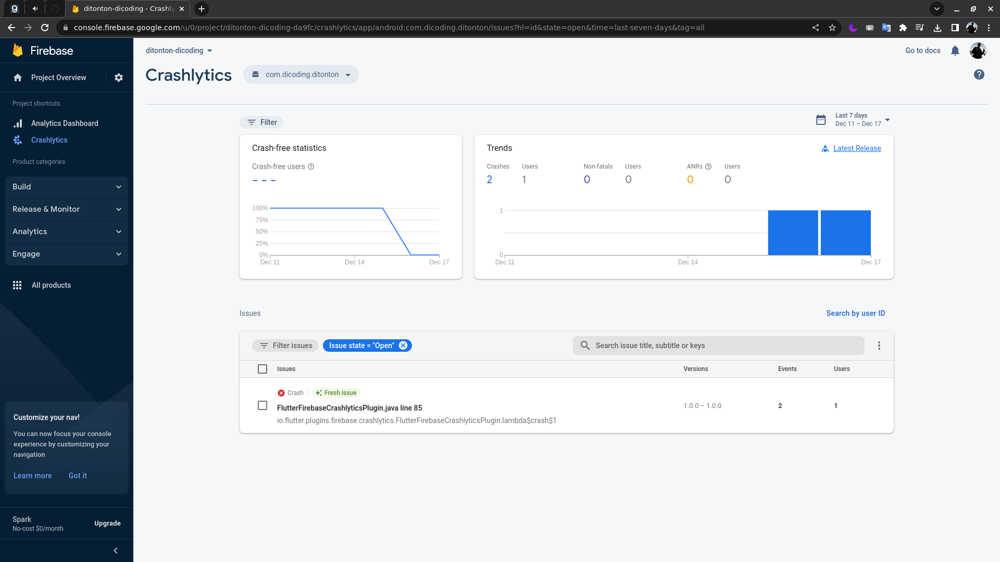

# Ditonton by Dicoding

## Link
[**Github Repository Link**](https://github.com/arif-pandu/ditonton-dicoding-submission)

 
 

## Preview CI(Codemagic)

 
 

## Preview Firebase Analytics

 
 

## Preview Firebase Crashlytics
